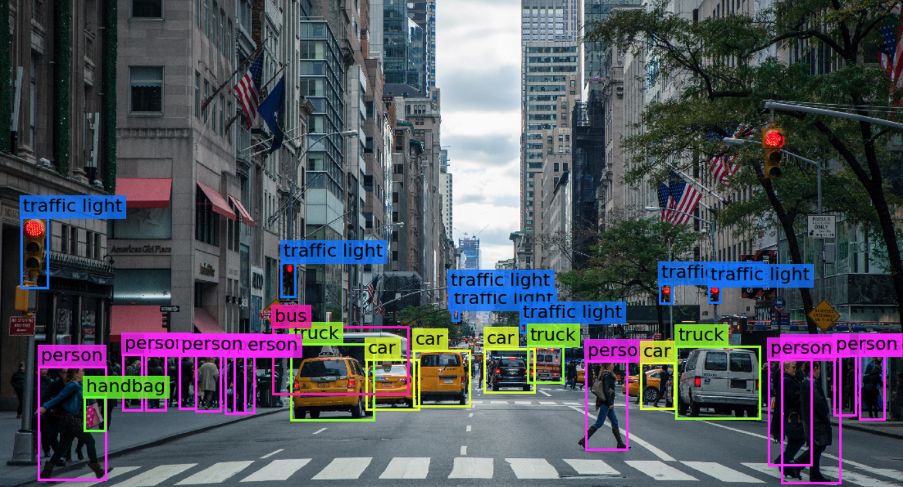

# **Hi, I’m Mohanad Ahmed (Mo. A)**

*🎓 Final-Year Mechanical Engineering Student* 
*🤖 Mechatronics, ML & Computer Vision Enthusiast*

# **About Me**

*I am a final-year mechanical engineering student with a strong focus on mechatronics systems, machine learning, and computer vision. I am particularly interested in designing intelligent, data-driven engineering solutions that combine mechanical understanding with modern AI techniques.*

# **Core Interests**

*🤖 Mechatronics Systems & Intelligent Automation*

*🧠 Machine Learning & Applied Artificial Intelligence*

*👁️ Computer Vision & Visual Inspection Systems*

*🔧 Fault Detection, Condition Monitoring & Predictive Models*

# **Technical Skills**

*Programming & Data*

*Python*

*Data preprocessing, feature engineering, model evaluation*

*Scikit-learn, MLflow*

*Classification pipelines & hyperparameter optimization*

*Engineering modeling and numerical analysis*

*Software Practices*

*Modular and scalable project structures*

*Experiment tracking & reproducibility*

*Git & GitHub for version control*

# **Current Focus**

*Developing software engineering skills and production-grade machine learning pipelines*

AI-based fault detection and monitoring systems

Applying computer vision to engineering problems

Strengthening foundations in mechatronics–AI integration

Professional Goals

Build reliable, interpretable, and scalable intelligent systems
